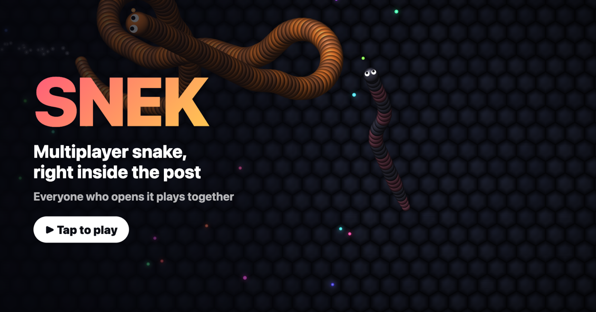

# SNEK: multiplayer snake inside a tweet

Play: **https://snekarena.com** · share link for posts: `https://snekarena.com/r/main`

> **This is a fun experiment.** I saw someone put a playable game inside a post on X and wanted to see how it works and how cool it could get. The game is free to play. The only money involved is optional sponsor spots on the leaderboard, sold through Stripe. It isn't affiliated with or endorsed by X Corp. or the makers of any other snake game, and it isn't trying to get around anyone's rules. If X asks for embeds like this to come down, they come down.

A slither-style multiplayer snake game that plays inside an X (Twitter) post. Click the post and you're straight in, playing everyone else who opened it. There's no menu, no install and no account needed.



## How it works

- **The embed** is a standard X [player card](https://developer.x.com/en/docs/x-for-websites/cards/overview/player-card). The share link (`/r/<room>`) carries `twitter:card=player` meta tags that point at `/play/<room>`, which X loads in an iframe. The page sends `frame-ancestors` so only X (and the site itself) can frame it.
- **The server** is one Cloudflare Worker plus a Durable Object per room. The room object runs the authoritative simulation at 20 ticks/s: movement, collisions, food and bots.
- **The wire protocol** is compact binary over a WebSocket. A client only receives the snakes and food near its own view, so it uses about 2 KiB/s. The client rebuilds every snake body from head positions using the same spacing rule as the server.
- **The client** is about 27 KB of TypeScript with no framework. WebGL2 instanced rendering handles segments, food, glows and the hex floor, and a canvas/DOM overlay handles the HUD.
- **First seconds:** your snake spawns on autopilot with a short shield, so the embed is already playing the moment it opens. Your first mouse move or touch takes over. A few bots (labelled 🤖) keep quiet rooms busy and leave as real players join.
- **Names:** you start as `guest####`. Tap your name to set your own; it's remembered on that device. There are no accounts and no sign-in, and nothing about you is stored.
- **Leaderboard:** top snakes by length, plus a sponsor section. Sponsor spots are bought through Stripe Checkout at three price points ($500 / $300 / $100). Buyers can raise the quantity, spots last 7 days, and the board ranks sponsors by total paid. Payments are recorded by Stripe's signed webhook or the checkout success page. It collapses to a small pill and opens when you tap it or die.

## Controls

| | Steer | Boost (costs length) |
|---|---|---|
| Desktop | move the mouse (or A/D, ←/→) | hold click / space |
| Phone | drag anywhere (floating joystick) | second finger or the BOOST button |

## Run it locally

```bash
npm install
cp .dev.vars.example .dev.vars   # local-only secrets, never committed
npm run dev                      # builds the client, starts wrangler on 127.0.0.1:8787
```

- `http://127.0.0.1:8787/` opens the game full-page.
- `http://127.0.0.1:8787/dev-embed.html` shows it inside a mock post at tweet size.

## Tests

```bash
npm run check      # TypeScript, client and worker
npm run test:sim   # 2 simulated minutes: perf, collisions, growth, client/server sync
npm run test:unit  # sponsorship ranking, expiry, live-key guard, webhook signatures
npm run test:e2e   # against a running server: card meta, names, steering, sponsors
npm run test:steer # the snake actually turns where you steer (local or BASE=https://snekarena.com)
npm run test:sponsor  # full Stripe checkout flow against scripts/mock-stripe.mjs
```

## Configuration

| Variable | Purpose |
|---|---|
| `ADMIN_TOKEN` | Bearer token for the admin endpoints (house sponsors, removing a sponsorship) |
| `STRIPE_SECRET_KEY` | Stripe key for sponsor checkout. Test keys only, unless `STRIPE_ALLOW_LIVE=1` |
| `STRIPE_WEBHOOK_SECRET` | Signing secret for the webhook at `/api/stripe/webhook` (`checkout.session.completed`) |
| `SPONSOR_HOURS` | How long a paid spot lasts, in hours (default 168, i.e. 7 days) |
| `STRIPE_ALLOW_LIVE` | Set to `1` to allow a live Stripe key (real charges) |

Set production values with `wrangler secret put <NAME>`.

## Notes

- X's player-card guidelines are written with video and audio in mind, and X decides what gets embedded. Treat this as an experiment that could stop working at any time.
- All art is drawn procedurally in shaders. There are no third-party game assets.
